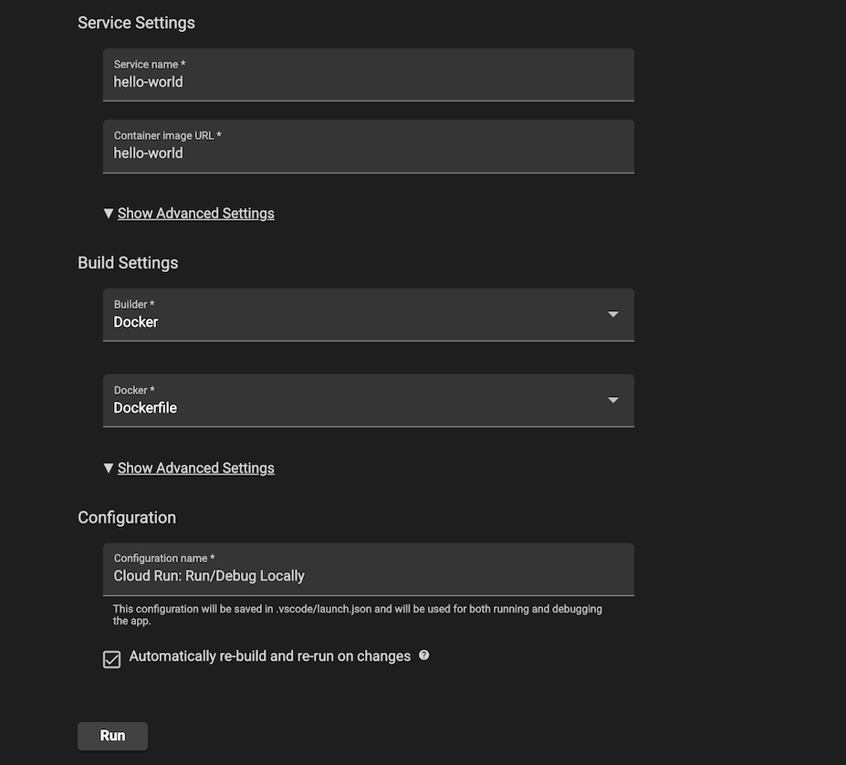
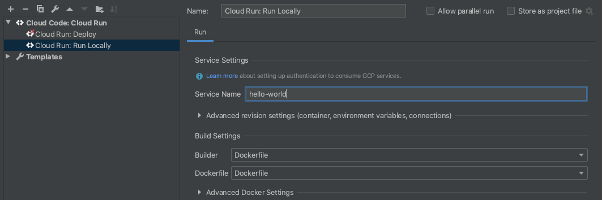
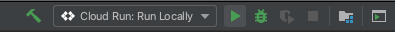

# vSelf application on Celo blockchain

# MyTicket Contract (Truffle + Remote Node)
 
 'MyTicket' contract is supported by truffle and celo 
 - Utilizes ERC721 standard for access regulation based on NFTs

Truffle v5.1.39 (core: 5.1.39)
Solidity - 0.8.4 (solc-js)
Node v16.7.0
Web3.js v1.2.1

Uninstall the current version of Truffle, `npm uninstall -g truffle`.

Reinstall with `npm install -g truffle@5.1.39`.

# API for vSelf application on Celo 

We use a [Cloud Run](https://cloud.google.com/run/docs) application that renders a simple webpage.

For details on how to use this sample as a template in Cloud Code, read the documentation for Cloud Code for [VS Code](https://cloud.google.com/code/docs/vscode/quickstart-cloud-run?utm_source=ext&utm_medium=partner&utm_campaign=CDR_kri_gcp_cloudcodereadmes_012521&utm_content=-) or [IntelliJ](https://cloud.google.com/code/docs/intellij/quickstart-cloud-run?utm_source=ext&utm_medium=partner&utm_campaign=CDR_kri_gcp_cloudcodereadmes_012521&utm_content=-).

### Table of Contents
* [Getting Started with VS Code](#getting-started-with-vs-code)
* [Getting Started with IntelliJ](#getting-started-with-intellij)
* [Sign up for User Research](#sign-up-for-user-research)

---
## Getting Started with VS Code

### Run the app locally with the Cloud Run Emulator
1. Click on the Cloud Code status bar and select 'Run on Cloud Run Emulator'.  

2. Use the Cloud Run Emulator dialog to specify your [builder option](https://cloud.google.com/code/docs/vscode/deploying-a-cloud-run-app#deploying_a_cloud_run_service). Cloud Code supports Docker, Jib, and Buildpacks. See the skaffold documentation on [builders](https://skaffold.dev/docs/pipeline-stages/builders/) for more information about build artifact types.  

3. Click ‘Run’. Cloud Code begins building your image.

4. View the build progress in the OUTPUT window. Once the build has finished, click on the URL in the OUTPUT window to view your live application.  

5. To stop the application, click the stop icon on the Debug Toolbar.

---
## Getting Started with IntelliJ

### Run the app locally with the Cloud Run Emulator

#### Define run configuration

1. Click the Run/Debug configurations dropdown on the top taskbar and select 'Edit Configurations'.  

2. Select 'Cloud Run: Run Locally' and specify your [builder option](https://cloud.google.com/code/docs/intellij/developing-a-cloud-run-app#defining_your_run_configuration). Cloud Code supports Docker, Jib, and Buildpacks. See the skaffold documentation on [builders](https://skaffold.dev/docs/pipeline-stages/builders/) for more information about build artifact types.  

#### Run the application
1. Click the Run/Debug configurations dropdown and select 'Cloud Run: Run Locally'. Click the run icon.  

2. View the build process in the output window. Once the build has finished, you will receive a notification from the Event Log. Click 'View' to access the local URLs for your deployed services.  

